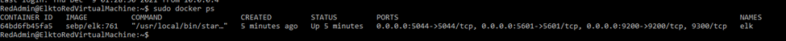

# Automated Elk Stack Deployment
`By Joey Xuereb
`

The files in this repository were used to configure the network depicted below.

These files have been tested and used to generate a live ELK deployment on Azure. They can be used to either recreate the entire deployment pictured above. Alternatively, select portions of the playbook file may be used to install only certain pieces of it, such as Filebeat.

* [Elk Playbook](https://github.com/jcxuereb/Elk_Stack_Project/blob/main/YAML_Scripts/Elk_Playbook.yml)

This document contains the following details:

* Description of the Topologu
* Access Policies
* ELK Configuration
	* Beats in Use
	* Machines Being Monitored
* How to Use the Ansible Build
	
### Description of the Topology

The main purpose of this network is to expose a load-balanced and monitored instance of DVWA, the D*mn Vulnerable Web Application.

Load balancing ensures that the application will be highly **responsive**, in addition to restricting **traffic** to the network.

* **Load balancers maintains the Availability of data in the CIA triad of security, protecting the system against potential DDoS attacks by distributing traffic across multiple servers.** 
* **The advantage of a jump box is the security architecture it provides, by controlling access to other machines by allowing connections from specific IP adresses, acting similar to a gateway router as an origination point to connect to other servers.**

Integrating an ELK server allows users to easily monitor the vulnerable VMs for changes to the **data logs** and **system files**.

* **Filebeats monitors the log file and watches for changes in the file system.**
* **Metricbeat records machine metric data and statistics, such as uptime, from the system and services running on the server.**

The configuration details of each machine may be found below.

| Name                      | Function  |  IP Address | Operating System |
|---------------------------|-----------|-------------|------------------|
| JumpBoxProvisioner        | Gateway   |  10.0.0.4   | Linux            |
| Web-1                     | Webserver |  10.0.0.5   | Linux            |
| Web-2                     | Webserver |  10.0.0.7   | Linux            |
| Elk-Stack-Virtual-Machine | Monitoring|  10.1.0.4   | Linux            |

### Access Policies

The machines on the internal network are not exposed to the public Internet. 

Only the **Jump Box Provisioner** machine can accept connections from the Internet. Access to this machine is only allowed from the following IP addresses: 

* **70.88.74.218**

Machines within the network can only be accessed by **the Jump Box Virtual Machine**.

* **Access to the Elk VM is gained through the Jump Box VM with IP address is 20.85.227.216**

A summary of the access policies in place can be found in the table below.

| Name                      | Publicly Accessible | Allowed IP Addresses |
|---------------------------|---------------------|----------------------|
| JumpBoxProvisioner        | Yes                 | 70.88.74.218         |
| Web-1                     | No                  | 10.0.0.4             |
| Web-2                     | No                  | 10.0.0.4             |
| Elk-Stack-Virtual-Machine | No                  | 10.0.0.4             |

### Elk Configuration

Ansible was used to automate configuration of the ELK machine. 

* [Ansible Playbook](https://github.com/jcxuereb/Elk_Stack_Project/blob/main/YAML_Scripts/Ansible_Playbook.yml) 

No configuration was performed manually, which is advantageous for the following reasons:

* **Ansible allows for quick and easy deploying of multi-tier application through a single YAML playbook.**
* **Ansible simplifies the process of configuring additional machines.**
* **Ansible simplifies the process of updating changes to all existing machines.**
* **If a playbook is not used changes will have to be made to each individual machine.**

The playbook implements the following tasks:

- **Installs `docker.io` which ficilitates the installation of containers**
- **Installs `python-pip` packages**
- **Installs Docker module**
- **Configure to use more memory by setting the `vm.max_map_count` to 262144**
- **Downloads and launches Docker elk container `sebp/elk:761`**

The following screenshot displays the result of running `docker ps` after successfully configuring the ELK instance.

### Target Machines & Beats
This ELK server is configured to monitor the following machines:

* **Web-1 - 10.0.0.5**
* **Web-2 - 10.0.0.7**

We have installed the following Beats on these machines:

* **Filebeat and Metricbeat**
	* [Filebeat Configuration](https://github.com/jcxuereb/Elk_Stack_Project/blob/main/YAML_Scripts/Filebeat_Configuration.yml)
	* [Filebeat-Metricbeat Playbook](https://github.com/jcxuereb/Elk_Stack_Project/blob/main/YAML_Scripts/Filebeat_Metricbeat_Playbook.yml)

These Beats allow us to collect the following information from each machine:

* **Filebeat monitors specified log files or locations which is collected and delivered to Elasticsearch or Logstash for indexing.**
* **Metricbeat periodically collects metrics from systems and services where you can find top-like statistics for every process running.**

### Using the Playbook
In order to use the playbook, you will need to have an Ansible control node already configured. Assuming you have such a control node provisioned: 

SSH into the control node and follow the steps below:

* **Copy the `filebeatconfig.yml` file to `/etc/ansible/roles/`**
* **Update the `/etc/ansible/host` file to include grounded private IP address of web servers separate from the private IP address of the the ELK VM.**
* **Run the playbook, and navigate to `http://40.113.238.153:5601/app/kibana` to check that the installation worked as expected.**

Commands to run to download the playbook

**1. `$ ssh [username]@[JumpBoxIP]`**

**2. `$ sudo docker container list -a`**

**3. `$ sudo docker start [container name]`**

**4. `$ sudo docker attach [container name]`**

**5. `$ nano /etc/ansible/hosts (add additional private IPs)`**

**6. `$ ansible-playbook /etc/ansible/[install-elk-playbook].yml`**

**7. `$ cp filebeatconfig.yml > /etc/ansible/roles/`**

**8. `$ ansible-playbook /etc/ansible/roles/filebeatplaybook.yml`**

**9. `http://[ElkexternalIPaddress]:5601/app/kibana`**
